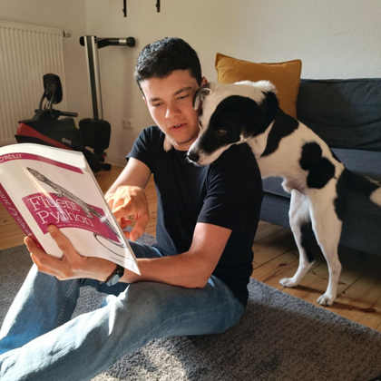
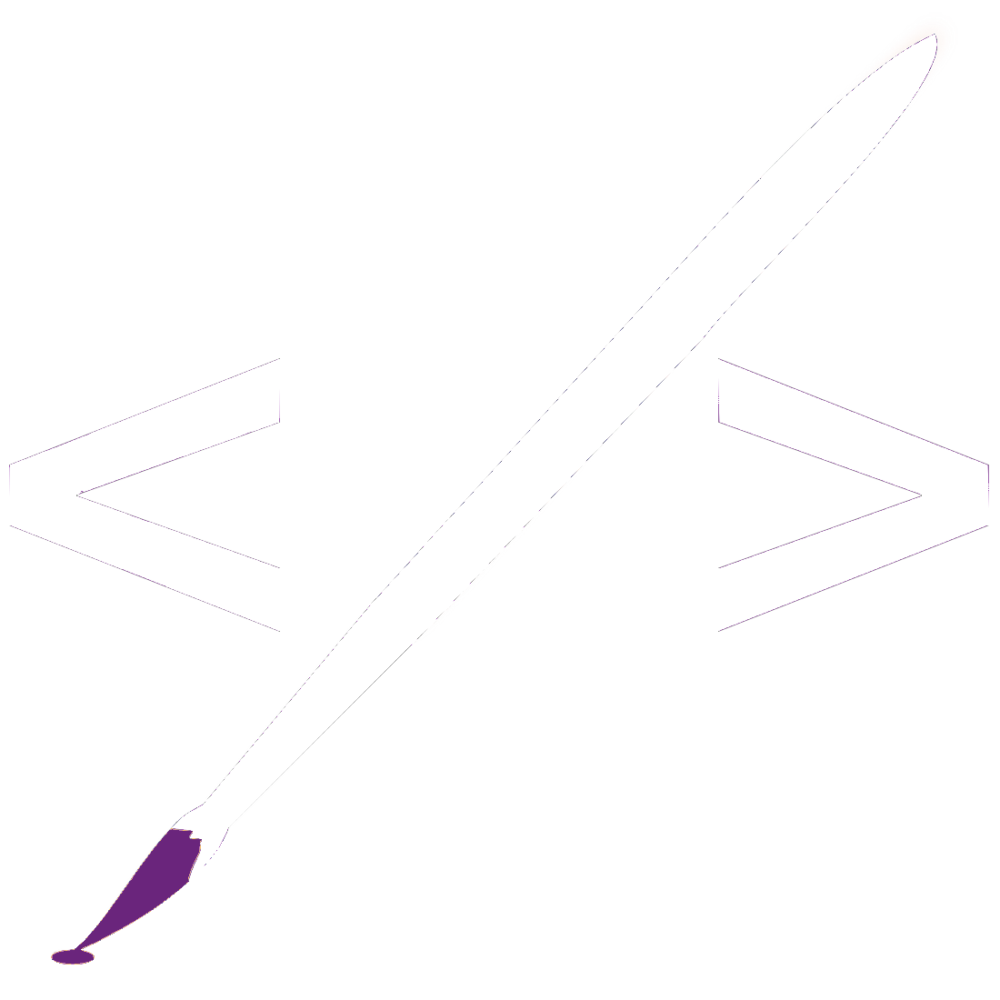

## Hi there, I'm Marius! 👋

I am a **Product-Oriented Software Developer** and tech enthusiast with over a decade of experience (_Django, Rails, FastAPI, Vue, React, Typescript, Docker, and more_). I like building things and helping people. Currently, founder at Otterly (Project Management Platform for freelancers).

When I'm not climbing, I'm busy training my advanced **D.A.I.** (Dog Artificial Intelligence) model to become fluent in Python using reward based learning. BarkGPT with be available soon in Blockbuster stores near you.
Right now he is stuck in an inifinite `while` loop waiting for treats and pets.

I am enthusiastic about taking on diverse challenges and am open to various work arrangements (remote, hybrid), including permanent roles, freelancing, and consulting opportunities.

I currently live in Berlin, Germany. 

You can find me on:

[mariusavram.com (Website)](mariusavram.com)

[Github (You are here)](https://github.com/mariusavram91)

[Linkedin](https://ie.linkedin.com/in/mariusavram91)

Have a nice day!

---

<pre>
                                     🛰️
 
                       ☁️         ☁️

〰️🚣〰️〰️〰️〰️〰️〰️〰️〰️〰️〰️〰️〰️〰️〰️〰️〰️
〰️〰️〰️〰️〰️〰️〰️〰️〰️〰️〰️〰️〰️〰️〰️〰️〰️〰️〰️
</pre>

 
